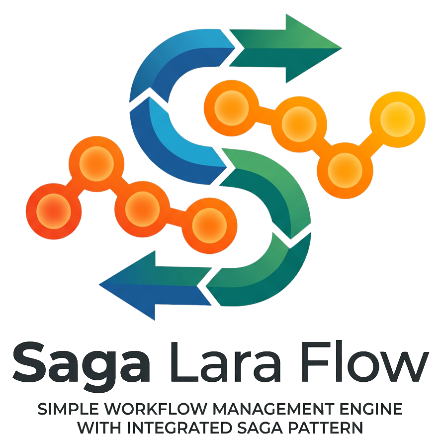

<div align="center">

<a href="https://sagalaraflow.dev">
  <picture>
    <source media="(prefers-color-scheme: dark)" srcset="art/logo-dark.png">
    
  </picture>
</a>

[](https://packagist.org/packages/discovery-ukraine/saga-lara-flow)
[](https://github.com/discovery-ukraine/saga-lara-flow/actions/workflows/run-tests.yml)
[](https://github.com/discovery-ukraine/saga-lara-flow/actions/workflows/phpstan.yml)

</div>

**Saga Lara Flow** is a workflow management engine with an integrated **Saga pattern**, built on top
of Laravel Queues.

It lets you write a long-running, durable business process as a single
deterministic PHP method: each step runs, is recorded, and survives worker
restarts through exception-based suspension and replay. When a step fails partway
through, registered **compensations** roll back the completed work in reverse
order.

It is inspired by
[Durable Workflow (formerly Laravel Workflow)](https://github.com/durable-workflow/workflow),
but it is not a replacement for it. Saga Lara Flow positions itself as a lighter,
native-Laravel alternative: no Fibers, generators, or promises — just queues, an
event log, and Eloquent.

📚 **Full documentation: [sagalaraflow.dev](https://sagalaraflow.dev)**

```php
use DiscoveryUkraine\SagaLaraFlow\Workflow;

class CheckoutWorkflow extends Workflow
{
    public function handle(string $orderId): array
    {
        $charge = $this->action(ChargeCard::class, $orderId)
            ->compensateWith(RefundCard::class, $orderId)
            ->run();

        $this->action(ReserveStock::class, $orderId)
            ->compensateWith(ReleaseStock::class, $orderId)
            ->run();

        $this->action(ShipOrder::class, $orderId)->run();

        return ['charge' => $charge];
    }
}
```

```php
use DiscoveryUkraine\SagaLaraFlow\Facades\SagaFlow;

$run = SagaFlow::create(CheckoutWorkflow::class)
    ->withArguments('order-42')
    ->withTags(['tenant' => 'acme', 'order' => 'order-42'])
    ->run(); // dispatched onto the queue
```

If `ReserveStock` or `ShipOrder` fails, `RefundCard` (and any other registered compensation) runs
automatically, in reverse order.

## Table of contents

- [Installation](#installation)
- [Configuration](#configuration)
- [Your first workflow](#your-first-workflow)
- [Actions](#actions)
- [Sagas & compensations](#sagas--compensations)
- [Signals](#signals)
- [Side effects](#side-effects)
- [Parallel actions](#parallel-actions)
- [Optional actions](#optional-actions)
- [Child workflows](#child-workflows)
- [Tags & querying](#tags--querying)
- [Expiration & monitoring](#expiration--monitoring)
- [Queues, locks & idempotency](#queues-locks--idempotency)
- [Synchronous execution](#synchronous-execution)
- [Versioning long-running workflows](#versioning-long-running-workflows)
- [Octane & multi-tenancy](#octane--multi-tenancy)
- [Determinism rules](#determinism-rules)
- [Events](#events)
- [Artisan commands](#artisan-commands)
- [Testing your workflows](#testing-your-workflows)

## Installation

Install the package via Composer:

```bash
composer require discovery-ukraine/saga-lara-flow
```

Run the migrations:

```bash
php artisan migrate
```

The engine's migration ships with the package, so `migrate` picks it up directly — no publish step.
Future versions add their migrations the same way: `composer update` then `php artisan migrate`.

Optionally publish the config file:

```bash
php artisan vendor:publish --tag="saga-lara-flow-config"
```

Customize the schema through config — `database.table_prefix`, `database.connection`, and the
swappable `models.*` — rather than by editing the migration. (The migration runs automatically; do
not also `vendor:publish` it, or `migrate` would try to run both the published copy and the
package's own.)

**Requirements:** PHP `^8.5`, Laravel 13 (`illuminate/*: ^13`). The package registers its service
provider and the `SagaFlow` facade automatically.

## Configuration

Every setting lives in `config/saga-lara-flow.php`. The most common ones:

- **Dedicated database connection.** `database.connection` (env `SAGA_LARA_FLOW_DB_CONNECTION`) keeps
  the engine's tables on their own connection; `null` uses the app default. `database.table_prefix`
  (default `saga_`) prefixes every table.
- **Swappable models.** Every row model under `models.*` can be pointed at your own subclass.
- **Queue.** `queue.connection` / `queue.queue` control where workflow and action jobs run;
  `queue.after_commit` dispatches after the surrounding DB transaction commits.
- **Locks.** `locks.*` configure the `WithoutOverlapping` middleware that serializes concurrent
  drives of a single run. `workflow_ttl_seconds` / `action_ttl_seconds` / `block_seconds` are in
  seconds. See [Queues, locks & idempotency](#queues-locks--idempotency).
- **Monitor.** `monitor.expiration.defaults` set implicit deadlines (seconds) for `run` / `action` /
  `signal` — `null` means no default. See [Expiration & monitoring](#expiration--monitoring).
- **Sagas / parallel / children.** Default compensation, failure, and close policies.
- **Tenancy.** `tenancy.*` callable hooks — see [Octane & multi-tenancy](#octane--multi-tenancy).

## Your first workflow

Generate a workflow and an action:

```bash
php artisan make:workflow ProvisionAccountWorkflow
php artisan make:action  CreateTenant
```

A **workflow** is a class extending `Workflow` with a deterministic `handle()`. A **workflow author**
never `new`s an action — they schedule it through the DSL, and the engine runs, records, and replays
it for you:

```php
use DiscoveryUkraine\SagaLaraFlow\Workflow;

class ProvisionAccountWorkflow extends Workflow
{
    public function handle(string $email): array
    {
        $tenantId = $this->action(CreateTenant::class, $email)->run();
        $this->action(SendWelcomeEmail::class, $email)->run();

        return ['tenant' => $tenantId];
    }
}
```

An **action** is a unit of work with native Laravel dependency injection:

```php
use DiscoveryUkraine\SagaLaraFlow\Action;

class CreateTenant extends Action
{
    public function handle(TenantRepository $tenants, string $email): string
    {
        return $tenants->provision($email)->id;
    }
}
```

Start it:

```php
use DiscoveryUkraine\SagaLaraFlow\Facades\SagaFlow;

$run = SagaFlow::create(ProvisionAccountWorkflow::class)
    ->withArguments('jane@example.com')
    ->run();          // queued; returns a Pending FlowRun immediately

// or run it inline, driving every step in-process:
$run = SagaFlow::create(ProvisionAccountWorkflow::class)
    ->withArguments('jane@example.com')
    ->runSync();      // returns a Completed FlowRun
```

## Actions

`action(string $actionClass, mixed ...$arguments)` returns an `ActionBuilder`; `run()` executes it
and returns the action's result. Arguments passed here are forwarded to the action's `handle()`
after its injected dependencies.

**Retries and timeouts** use native Laravel queue semantics — declare them on the action:

```php
class ChargeCard extends Action
{
    public int $tries = 3;    // up to 3 attempts when queued
    public int $timeout = 30; // seconds per attempt

    public function handle(PaymentGateway $gateway, string $orderId): string
    {
        return $gateway->charge($orderId);
    }
}
```

A **per-step deadline** (independent of the queue timeout) is set on the builder:

```php
$this->action(ChargeCard::class, $orderId)
    ->expiresAt(now()->addMinutes(2))
    ->run();
```

`run()` throws when the action ultimately fails, so a workflow can react to it:

```php
use DiscoveryUkraine\SagaLaraFlow\Exceptions\ActionFailedException;
use DiscoveryUkraine\SagaLaraFlow\Exceptions\FlowExpiredException;

try {
    $this->action(ChargeCard::class, $orderId)->run();
} catch (ActionFailedException $e) {
    // retries exhausted — decide what the workflow does next
} catch (FlowExpiredException $e) {
    // the step (or run) passed its deadline
}
```

Two things about *when* this throws:

- **It surfaces on replay, not the instant the action fails.** In queued mode the action runs in its
  own job, off the `handle()` stack, and retries per `$tries`. Once it ultimately fails the engine
  re-drives `handle()` from the top and the failed step replays as a throw — that is where your
  `try/catch` catches it. In **sync** mode the step runs inline and `run()` re-throws the action's
  **raw** exception (not `ActionFailedException`), so catch the concrete type you expect.
- **Use `try/catch` for local branching** — "if `ChargeCard` fails, try PayPal instead". For a
  cross-cutting "report whenever *any* workflow fails", listen to the `FlowFailed` event
  ([Events](#events)) instead: it fires once on the terminal transition — on both the direct-fail and
  the fail-after-compensation paths, and regardless of sync/queued. If you do report from inside a
  `catch` in `handle()`, **re-throw** afterwards so the engine still fails and compensates the run;
  swallowing the exception lets `handle()` run on past a step that has no result.

> ⚠️ Never catch `DiscoveryUkraine\SagaLaraFlow\Exceptions\Internal\FlowSuspended` (or any
> `InternalFlowControl`) — those are the engine's suspend/replay signals, not errors. Business
> exceptions (`ActionFailedException`, `FlowExpiredException`, `ChildWorkflowFailedException`, …) all
> extend `FlowException` and are safe to catch; the two internal signals live under
> `…\Exceptions\Internal\` and are the *only* things a broad `catch (\Throwable $e)` must re-throw:
> `if ($this->isFlowControl($e)) { throw $e; }`.

## Sagas & compensations

The Saga pattern trades distributed transactions for **compensating actions**: each step registers
how to undo itself, and on failure the engine rolls completed steps back in reverse order.

**Action-level compensation** (the primary style) attaches an undo to each step:

```php
public function handle(string $orderId): void
{
    $this->action(ChargeCard::class, $orderId)
        ->compensateWith(RefundCard::class, $orderId)
        ->run();

    $this->action(ReserveStock::class, $orderId)
        ->compensateWith(ReleaseStock::class, $orderId)
        ->run();

    // If this throws, ReleaseStock then RefundCard run automatically.
    $this->action(ShipOrder::class, $orderId)->run();
}
```

Compensation can also be a closure:

```php
$this->action(MakeReservation::class, $id)
    ->compensateWith(fn () => Reservation::release($id))
    ->run();
```

**Grouped sagas** via `saga()` express a compensation boundary explicitly and give you
group-level policies:

```php
use DiscoveryUkraine\SagaLaraFlow\Enums\CompensationFailurePolicy;

$this->saga()
    ->onCompensationFailure(CompensationFailurePolicy::Continue) // keep rolling back even if one undo fails
    ->compensateInParallel()                                     // run the group's undos concurrently
    ->step(ChargeCard::class, $orderId)->compensateWith(RefundCard::class, $orderId)
    ->step(ReserveStock::class, $orderId)->compensateWith(ReleaseStock::class, $orderId)
    ->run();
```

`CompensationFailurePolicy::Stop` (default) halts the rollback on the first failed compensation;
`Continue` presses on. Precedence for policies is **action > group > config**. If a compensation
itself fails under `Stop`, a `CompensationFailedException` surfaces.

## Signals

Signals let external code push data or decisions into a running workflow. Inside `handle()`,
`awaitSignal()` blocks the workflow (by suspending it) until the named signal arrives, then returns
its payload:

```php
public function handle(): void
{
    $decision = $this->awaitSignal('approval');           // suspends until delivered

    if (($decision['approved'] ?? false) === true) {
        $this->action(Publish::class)->run();
    }
}
```

A **timeout** turns an unanswered wait into a catchable exception:

```php
use DiscoveryUkraine\SagaLaraFlow\Exceptions\AwaitSignalTimeoutException;

try {
    $decision = $this->signal('approval')
        ->timeoutAfter(now()->addDay())
        ->wait();
} catch (AwaitSignalTimeoutException $e) {
    $this->action(AutoReject::class)->run();
}
```

Deliver a signal from anywhere via the handle:

```php
SagaFlow::loadFlow($runId)->signal('approval', ['approved' => true]);

// safe variant that returns false instead of throwing on a terminal run:
SagaFlow::loadFlow($runId)->signalIfRunning('approval', ['approved' => true]);
```

No `$runId`? Find the run by workflow and tag, then signal it. Use `signalable()` (alias `active()`),
**not** `running()` — a flow parked on `awaitSignal()` is `Waiting`, not `Running`:

```php
SagaFlow::query()
    ->whereWorkflow(ProvisionCompanyWorkflow::class)
    ->whereTag('company', $companyId)
    ->signalable()            // Pending, Running, or Waiting
    ->handles()
    ->first()
    ?->signal('owner-synced');
```

## Side effects

Anything non-deterministic (random values, `now()`, a UUID, an external read) must be wrapped in
`sideEffect()` so replay reuses the **recorded** value instead of computing a new one:

```php
public function handle(): void
{
    $reference = $this->sideEffect('reference', fn () => (string) Str::uuid());

    $this->action(CreateInvoice::class, $reference)->run();
}
```

The first execution records the value; every later replay of the run returns the same stored value.

## Parallel actions

`parallel()` runs several actions concurrently (as queued jobs, or inline under `runSync`) and
returns their results as a list:

```php
use DiscoveryUkraine\SagaLaraFlow\Enums\ParallelFailurePolicy;

[$a, $b, $c] = $this->parallel()
    ->action(FetchPricing::class, $sku)
    ->action(FetchInventory::class, $sku)
    ->action(FetchReviews::class, $sku)
    ->failFast()          // cancel the block on the first failure (default)
    ->run();
```

`->waitAllThenFail()` lets every step settle before the block fails; `failFast()` (the config
default, `ParallelFailurePolicy::FailFast`) short-circuits on the first hard failure. Steps in a
parallel block can carry their own compensations and `optionalAction()`.

## Optional actions

An optional action never fails the flow — its failure is swallowed and a fallback is returned:

```php
$score = $this->action(FetchRiskScore::class, $orderId)
    ->continueOnFailure()
    ->fallbackValueOnFail(0)
    ->run();

// shorthand:
$score = $this->optionalAction(FetchRiskScore::class, $orderId)
    ->fallbackValueOnFail(0)
    ->run();
```

You can also mark it declaratively with `#[ContinueOnFailure]` on the action class.

## Child workflows

A workflow can start another workflow and await its result. The child inherits the parent's
connection, queue, and **tenant context**:

```php
use DiscoveryUkraine\SagaLaraFlow\Enums\ChildClosePolicy;

public function handle(): array
{
    $result = $this->child(ShipmentWorkflow::class, ['order-42'])
        ->closePolicy(ChildClosePolicy::Cancel) // what happens to the child if the parent closes
        ->run();

    return ['shipment' => $result];
}
```

Close policies: `Abandon` (default — leave the child running), `Cancel` (cancel it), `Fail` (fail
it). A failing child throws `ChildWorkflowFailedException` (or `ChildWorkflowCancelledException`)
unless you call `->continueParentOnFailure()`. The default close policy is configurable
(`children.default_close_policy`) or per class via `#[ChildPolicy]`.

## Tags & querying

Attach searchable key/value tags at creation or from inside the workflow:

```php
SagaFlow::create(CheckoutWorkflow::class)
    ->withTags(['tenant' => 'acme', 'channel' => 'web'])
    ->run();

// inside handle():
$this->tag('priority', 'high');
```

Query runs with the fluent, type-safe `FlowQuery`:

```php
use DiscoveryUkraine\SagaLaraFlow\Enums\FlowStatus;

$stuck = SagaFlow::query()
    ->whereWorkflow(CheckoutWorkflow::class)
    ->whereTag('tenant', 'acme')
    ->waiting()
    ->before(now()->subHour())
    ->get();               // Collection<FlowRun>

$handles = SagaFlow::query()->running()->handles();   // Collection<FlowHandle>
$count   = SagaFlow::query()->failed()->count();
```

Status shortcuts: `running()`, `waiting()`, `completed()`, `failed()`, plus `active()` /
`signalable()` (Pending, Running, or Waiting) for finding a run to deliver a signal to.

Terminals: `get()`, `first()`, `count()`, `paginate()`, `handles()`, and `builder()` (the raw
Eloquent builder for ordering/limits).

## Expiration & monitoring

Runs, actions, and signal waits can carry deadlines — either explicitly (`->expiresAt(...)`,
`->timeoutAfter(...)`) or via the configured defaults in `monitor.expiration.defaults`. Something
has to *notice* an expired deadline; there are two ways to drive that sweep:

**Scheduler (recommended).** Run the monitor on a schedule:

```php
use Illuminate\Support\Facades\Schedule;

Schedule::command('saga-flow:monitor')->everyMinute();
```

**Queue looping (opt-in).** Drive the sweep off the queue worker's idle loop by enabling
`monitor.queue_looping.enabled` (throttled by `throttle_seconds`). Useful when you have no cron but
always-on workers.

For runs whose progress was lost to a *dropped job* (rather than a deadline), the **doctor** can
re-dispatch missing actions (`repair.redispatch_lost_actions`) and re-wake stuck waits
(`repair.wake_stuck_flows`) — enable `repair.enabled` and either schedule `saga-flow:repair` or loop
it off the worker (`repair.queue_looping.enabled`), or kick a single run manually with
`saga-flow:kick {run}` / `SagaFlow::kick($id)`. Each config key is documented in
[Expiration & monitoring](https://sagalaraflow.dev/expiration-and-monitoring).

## Queues, locks & idempotency

Every workflow and action runs as a queued job on the configured connection/queue. A run is driven
by replaying `handle()` from the recorded history; each operation is identified by a deterministic
`(flow_run_id, sequence)` pair, so a step that has **completed and recorded its result** is never
repeated — it is reused from history. The `WithoutOverlapping` locks (`locks.*`, TTLs and waits in
seconds) serialize concurrent drives of the same run so two workers can't advance it at once.

This is *not* automatic end-to-end idempotency. The reuse guarantee covers **recorded** steps only —
it does not make the work *inside* an action idempotent. If a job hangs, is retried, or dies after
performing its external effect (charging a card, calling an API) but before recording its result,
that effect can happen more than once. End-to-end idempotency depends on your action code: use an
idempotency key, prefer upserts, or check whether the effect already happened. The
`(flow_run_id, sequence)` pair makes a stable idempotency key to hand downstream. See
[Queues, locks & idempotency](https://sagalaraflow.dev/queues-locks-idempotency).

## Synchronous execution

`runSync()` drives the whole workflow in-process, using the same single replay loop as the queued
path — handy for tests, tinkering, or short workflows:

```php
$run = SagaFlow::create(CheckoutWorkflow::class)
    ->withArguments('order-42')
    ->runSync();

$run->status;   // FlowStatus::Completed
$run->result;   // the array handle() returned
```

The queued and synchronous paths are guaranteed to reach the **same** final database state.

## Versioning long-running workflows

A workflow may be suspended for days while its code keeps shipping. To change a running workflow's
logic without breaking in-flight runs, keep versions in separate classes/directories
(`App\Workflows\V1\CheckoutWorkflow`, `App\Workflows\V2\CheckoutWorkflow`) and pin a version at
creation:

```php
SagaFlow::create(\App\Workflows\V2\CheckoutWorkflow::class)
    ->version('v2')
    ->run();
```

Read the pinned version inside `handle()` with `$this->version()`; existing runs keep replaying
against the class they were created with.

## Octane & multi-tenancy

The engine runs each workflow/action `handle()` in the tenant the run was **created** for and
reverts afterwards, so nothing leaks between runs on a shared Octane or queue worker.

- **Capture at creation.** `SagaFlow::create(...)` snapshots the current tenant via the
  `tenancy.capture` hook onto `flow_runs.tenancy_context`. Child runs inherit the parent's context.
- **Auto-restore is opt-in.** Off by default (`tenancy.auto`). When on, the engine calls
  `tenancy.restore` before `handle()` and reverts in a `finally` (via `tenancy.end`, or by restoring
  the previous context). Override per class with `#[Tenancy(auto: true)]` (precedence: attribute > config).
- **Manual discovery.** Even with auto off, read the run's tenant inside `handle()`:
  `SagaFlow::tenancyContext()` returns `['tenant' => '…']` or `null`.

```php
// config/saga-lara-flow.php
'tenancy' => [
    'auto'    => false,
    'capture' => fn (): array => ['tenant' => tenant()?->getTenantKey()],
    'restore' => fn (array $c): void => tenancy()->initialize($c['tenant']),
    'end'     => null, // optional explicit revert; otherwise the previous context is restored
],
```

See the [multi-tenancy docs](https://sagalaraflow.dev/octane-and-multi-tenancy) for a full
stancl/tenancy integration example.

## Determinism rules

`handle()` is **replayed** from the start on every resume, so it must be deterministic:

- ✅ Do call actions, child workflows, signals, and parallel blocks through the DSL — their results
  are recorded and reused on replay.
- ✅ Do wrap any nondeterminism (`now()`, random, UUIDs, direct DB/HTTP reads) in `sideEffect()`.
- ❌ Don't branch on ambient state that can change between replays (wall-clock time, `rand()`,
  external reads) outside a `sideEffect()`.
- ❌ Don't catch the engine's control-flow exceptions (`FlowSuspended`) as if they were errors.

Break a rule and the history contract guard raises `HistoryContractMismatchException` when the
replay diverges from the recorded history.

## Events

The engine mirrors its `flow_events` log onto Laravel events you can listen to — e.g. `FlowStarted`,
`FlowCompleted`, `FlowFailed`, `FlowWaiting`, `FlowCancelled`, `ActionCompleted`, `ActionFailed`,
`CompensationCompleted`, `ChildWorkflowCompleted`, `SideEffectRecorded`, and more (see
`src/Events`). Register listeners as usual:

```php
use DiscoveryUkraine\SagaLaraFlow\Events\FlowFailed;

Event::listen(FlowFailed::class, function (FlowFailed $event): void {
    report($event->flowRun->workflow_class.' failed: '.$event->flowRun->id);
});
```

`FlowCancelled` carries an optional `?string $reason`, populated when you call
`$handle->cancel('reason here')`.

## Artisan commands

| Command                                                          | Purpose                                                          |
|------------------------------------------------------------------|------------------------------------------------------------------|
| `saga-flow:list {--status=} {--tag=} {--workflow=} {--limit=50}` | List runs, newest first, with filters.                           |
| `saga-flow:show {run} {--compact}`                               | Inspect a run: header, actions, signals, compensations, history. |
| `saga-flow:signal {run} {name} {--payload=}`                     | Deliver a JSON-payload signal and wake the run.                  |
| `saga-flow:cancel {run} {--compensate}`                          | Cancel a non-terminal run; `--compensate` rolls back first.      |
| `saga-flow:kick {run}`                                           | Manually re-drive a stuck run.                                   |
| `saga-flow:monitor`                                              | Expire overdue runs/actions and time out waits.                  |
| `saga-flow:repair`                                               | Recover runs whose progress was lost to a dropped job.           |
| `saga-flow:prune {--days=} {--before=} {--dry-run}`              | Delete old terminal runs and related rows.                       |
| `make:workflow {name}`                                           | Generate a workflow class in `App\Workflows`.                    |
| `make:action {name}`                                             | Generate an action class in `App\Actions`.                       |

These are CLI only — the package exposes no HTTP routes.

## Testing your workflows

Under test, the **queued** paths must run against a real database queue driven with
`queue:work --stop-when-empty` — the `sync` driver bypasses the suspend/replay machinery and won't
exercise the engine faithfully. `runSync()` is fine for asserting final state directly:

```php
$run = SagaFlow::create(CheckoutWorkflow::class)->withArguments('order-1')->runSync();

expect($run->status)->toBe(FlowStatus::Completed)
    ->and($run->result)->toBe(['charge' => 'ch_123']);
```

For queued assertions, set the queue to the `database` connection, dispatch with `->run()`, then
drain the queue before asserting. The package's own suite (`tests/`) is a working reference.

```bash
composer test        # Pest
composer analyse     # PHPStan (larastan, level 5)
composer lint        # Pint + PHPStan
```

## When should I use Durable Workflow instead?

Saga Lara Flow is intentionally a lighter, Laravel-native package. It is focused
on queues, Eloquent, an event log, replay, signals, child workflows, and
first-class Saga compensations inside a single Laravel application.

If you need a more complete workflow engine — SDK-neutral or polyglot workers,
standalone/external workers, Fiber-based execution, strict workflow-definition
fingerprinting, worker compatibility fleets, sticky execution, durable timers,
schedules, control-plane APIs, rich projections/observability, search attributes,
memos, history export/import, replay verification, external payload storage,
history budgets, or Temporal/Cadence-style operations — you should evaluate
[Durable Workflow](https://github.com/durable-workflow/workflow) instead.

## Changelog

Please see [CHANGELOG](CHANGELOG.md) for more information on what has changed recently.

## Contributing

Please see [CONTRIBUTING](CONTRIBUTING.md) for details.

## Security vulnerabilities

Please review [our security policy](SECURITY.md) on how to report security vulnerabilities.

## Credits

- [Andriy Karpishyn](https://github.com/mkrnnk)
- [All Contributors](../../contributors)

## License

The MIT License (MIT). Please see [License File](LICENSE.md) for more information.
